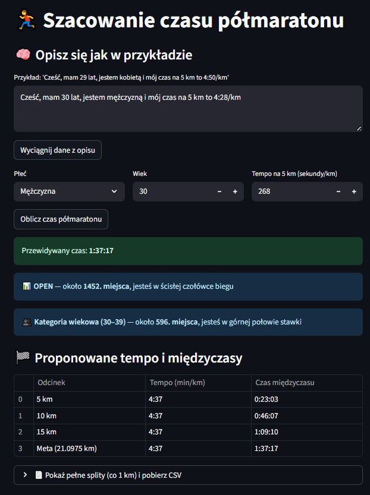
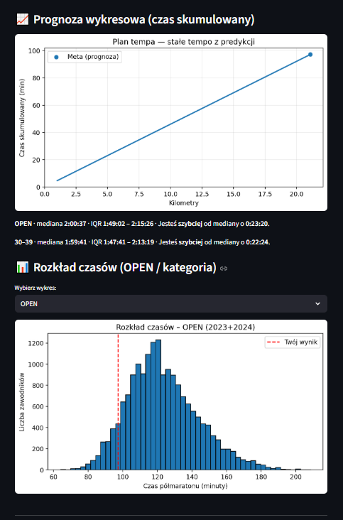

# 🏃 App – Half Marathon Time Estimator

**Created: 2025-09-10**

**Half Marathon** is a web application that uses **machine learning** and **sports data analysis** to predict half marathon finish times based on a runner’s **age**, **gender**, and **5 km pace**.

<div align="center" markdown>
[💻 Repository](https://github.com/damiandatax/halfmarathon-app){ .md-button }
</div>

---

**🎯 Purpose**

The goal of this project was to build an app that predicts a runner’s **estimated half marathon finish time** based on just a few simple inputs: gender, age, and 5 km pace.  
The project combines **machine learning**, **sports data analytics**, and **language model interaction (LLM)** — the model can automatically extract the needed data from natural language input such as:  
> “I’m 37 years old, male, and I run 5 km at 7:00 per kilometer.”

**The app allows users to:**

- estimate their half marathon finish time,  
- view predicted **overall (OPEN)** and **age group** rankings,  
- generate **split plans** (every 5 km),  
- visualize **pace charts** and **result distributions**,  
- convert pace formats (**min/km ↔ sec/km**),  
- and most importantly... stay motivated 💪

---

**🚀 Key Features**

- Enter data manually **or** via natural language input (LLM).  
- Automatic data extraction via **GPT-4o mini** or local **regex parser**.  
- Prediction of half marathon time and **ranking (OPEN / age category)**.  
- Split time plan and **forecasted pace chart**.  
- Interactive **histograms** of finish times (overall / category).  
- Built-in **pace converter** (min/km ↔ sec/km).

---

**🧩 Technologies & Tools**

| 💡 Layer | 🛠️ Technologies |
|-----------|-----------------------------|
| **Programming Language** | Python 3.11 |
| **Frontend / UI** | Streamlit |
| **Machine Learning** | scikit-learn, joblib |
| **Data Analysis** | pandas, numpy |
| **Visualization** | matplotlib |
| **Environment & Config** | python-dotenv, .env |
| **AI / LLM** | OpenAI GPT-4o mini |
| **LLM Monitoring** | Langfuse |
| **Hosting & Storage** | DigitalOcean App Platform, DigitalOcean Spaces |
| **Code Repository** | GitHub |
| **Experimentation & Modeling** | Jupyter Notebook |

---

**🧠 Architecture & Data Flow**

```text
User → [Streamlit Interface]
      ↓
[Local Parser / OpenAI GPT-4o-mini] → extract data (gender, age, pace)
      ↓
[ML Model (joblib)] → predict half-marathon finish time (seconds)
      ↓
[Presentation Layer] → tables, charts, distributions, messages
      ↓
[DigitalOcean Spaces / App Platform] → storage & deployment
```

---
**📊 Preview**
<div align="center">
  <table>
    <tr>
      <td align="center" width="50%">
        
        <br>
        <em>Example of predicted result and pacing plan</em>
      </td>
      <td align="center" width="50%">
        
        <br>
        <em>Distribution chart and ranking comparison</em>
      </td>
    </tr>
  </table>
</div>

